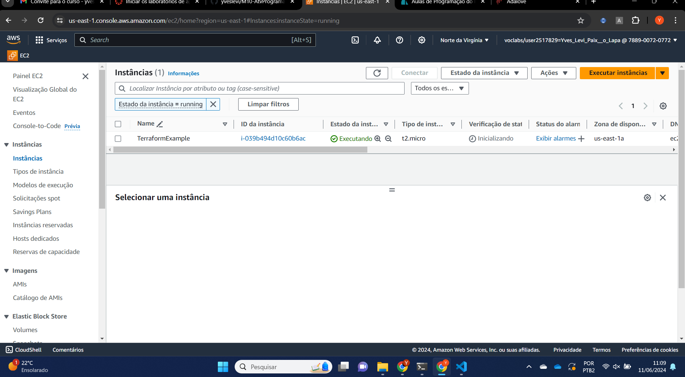

# Integração do Terraform com AWS Academy

## Introdução
Este guia traz um passo a passo do que pode ser realizado na última aula de programação da semana 9, com a integração do terraform com o AWS Academy e a consequente criação de instâncias.

## Passo 1: Configurar o Ambiente de Desenvolvimento

### Instalar o AWS CLI
No terminal da sua instância, execute o seguinte comando para verificar a versão do AWS CLI:

```sh
aws --version
```


### Configurar o AWS CLI
Configure o AWS CLI com suas credenciais AWS:

```sh
aws configure
```

Você será solicitado a inserir o Access Key ID, Secret Access Key, região padrão e formato de saída padrão.

Para conseguir essas credenciais você deverá acessar


Iniciar o laboratório (start lab) e depois clicar em **AWS Details**

Assim poderá ver as credenciais:


Copie-as e cole no bloco de notas que aparecerá após o comando: 

```sh
aws credentials
```

## Passo 2: Criar e Executar um Arquivo Terraform

### Criar um diretório de projeto
Crie um diretório para o seu projeto Terraform e navegue até ele:

```sh
mkdir my-terraform-project
cd my-terraform-project
```

### Criar e aplicar a configuração Terraform
Crie um arquivo chamado `main.tf` e adicione o seguinte conteúdo:

```hcl
provider "aws" {
  region = "us-east-1"
}

resource "aws_instance" "example" {
  ami           = "ami-0c55b159cbfafe1f0"
  instance_type = "t2.micro"

  tags = {
    Name = "ExampleInstance"
  }
}
```

### Inicializar e aplicar a configuração Terraform
Inicialize o Terraform e aplique a configuração:

```sh
terraform init
terraform apply
```

Digite "yes" quando solicitado para confirmar a aplicação do plano.

### Verificar a Instância no Console AWS
Após aplicar a configuração, você pode verificar a instância EC2 criada no Console AWS.



## Passo 3: Verificar e Gerenciar os Recursos

### Verificar o estado
Você pode verificar o estado dos recursos provisionados pelo Terraform:

```sh
terraform state list
```

### Destruir os recursos
Quando não precisar mais dos recursos, destrua-os para evitar custos desnecessários:

```sh
terraform destroy
```

Digite "yes" quando solicitado para confirmar a destruição dos recursos.

## Conclusão
Seguindo esses passos, você poderá configurar o Terraform no ambiente de laboratório do AWS Academy e começar a criar e gerenciar sua infraestrutura AWS com facilidade. Esta integração permite automatizar a provisão de recursos e gerenciar sua infraestrutura de maneira eficiente.
